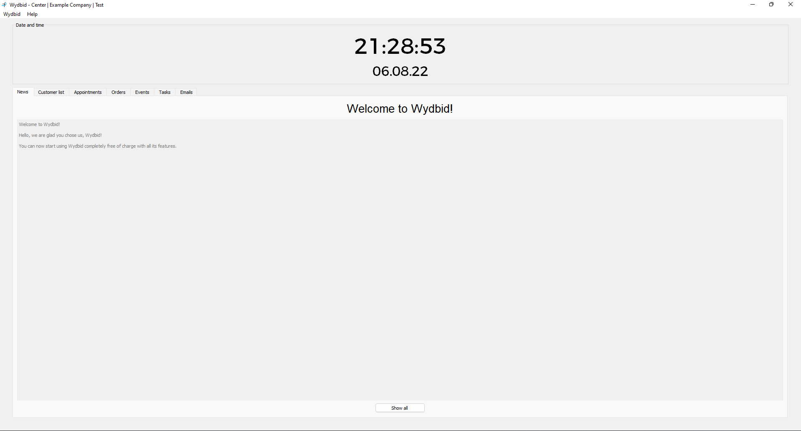

# Wydbid
### Description 📃

Wydbid is a customer management software (CRM system) designed for small companies. 🤵

### Status 👷

Still in work 🚧

No beta version yet 🔮

### Images 🖼️

#### Dark Theme

  
  
  

#### Light Theme

  
  
  

### Startup guide

#### Requirements

- [`Python 3.6 or higher`](https://www.python.org/downloads/)
- [`PyQt5`](https://pypi.org/project/PyQt5/)
- [`Screeninfo`](https://pypi.org/project/screeninfo/)
- [`Wydbid`](https://github.com/NiklasWyld/Wydbid) or [`Git`](https://git-scm.com/downloads)

#### Startup

- **If you use Git:** `git clone https://github.com/NiklasWyld/Wydbid.git` **Else:** You have to download the repository
- Open a terminal
- Then navigate there to the downloaded Wydbid folder (`cd Wydbid` or `cd Wydbid-main`)
- Install the required packages with `pip install -r requirements.txt`
- Then just open Wydbid using your terminal (`python3 Wydbid.py`)
- Now Wydbid should open and you can start creating companies and employees and set it up the way you want.
- If there is an error, see if you have Python 3.6 or higher and ran `pip install -r requirements.txt`.
- If you have checked or made that. And the error should remain, please contact `niklaspeter123#7578` via Discord.

###### If you are on Linux, you must run this command to be able to start Wydbid:

`sudo ln -s /usr/lib/x86_64-linux-gnu/libxcb-util.so.1`

### Features 🔖

##### Many functions will only come in the future

- Manage customers
- Manage appointments
- Manage orders
- Manage events
- Manage purchases
- Manage companies and employees
- Contact with customers
- Back up and store important data

### Report bugs 🐞

If you find bugs, please contact `niklaspeter123#7578` on Discord.

### License 📜

GPL-3.0 license
